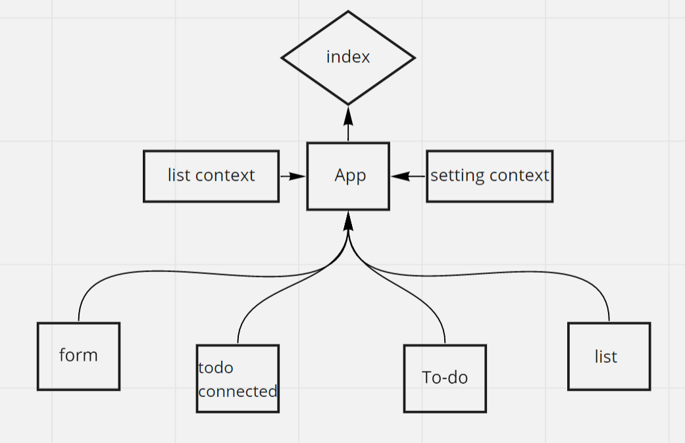

## LAB 31 - Context API
#### To Do List Manager Phase 1: Incorporate configuration settings to the application

In this phase, we’ll be adding some top-level settings for the application, so that the user can make some display choices that the app will use by default.

### Phase 1 Requirements
In Phase 1, we’re going to perform some refactoring of the To Do application as built by another team. This application mixes application state and user settings at the top level and passes things around. It was a good proof of concept, but we need to make this production ready.

- Style the application using the Blueprint Component API{target:_blank}

- Properly modularize the application into separate components

- Implement the Context API to make some basic application settings available to components

1- How many To Do Items to show at once
2- Whether or not to show completed items

#### Based on global configuration

- Show a maximum of a certain number of items per screen in the <List /> component
- Provide “next” and “previous” links to let the users navigate a long list of items
- Hide or show completed items in the list

#### Implement this using context

- Create a context for managing application display settings and provide this at the application level
- Display or Hide completed items (boolean)
- Number of items to display per screen (number)
- Default sort field (string)
- Manually set (hard code) those state settings in the context provider’s state, they should not be changeable

## Links:

codesandbox: https://codesandbox.io/s/hungry-oskar-yk1i9

PR: https://github.com/Batoolayyad/todo-app/pull/5

## UML:

## LAB 32: Context API - Behaviors
#### To Do List Manager Phase 2: Incorporate configuration settings to the application

In this phase, we’ll be adding an editor so that users can save their preferences for the application, allowing them to change some of the default behaviors

### Phase 2 Requirements
In Phase 2, we’re going to extend the functionality of our application by allowing the user to make some decisions on how they would like the application to function. Specifically, we’ll let them make changes to 2 settings.

#### Implement the Context API to make some basic application settings available to components
- How many To Do Items to show at once
- Whether or not to show completed items
#### Provide the users with a form where they can change the values for those settings
- This should be given in the form of a new component, perhaps linked to from the main navigation
- Hint: Use Browser Router to create the page/route/component for this
##### Save the users choices in Local Storage
##### Retrieve their preferences from Local Storage and apply them to the application on startup

### Technical requirements for the core application are unchanged from the prior phases, with the following additions and notes:

#### Based on global configuration

- Show a maximum of a certain number of items per screen in the <List /> component
- Provide “next” and “previous” links to let the users navigate a long list of items
- Hide or show completed items in the list
- Optional: Sort the items based on any of the keys (i.e. difficulty)

#### Implement this using context

- Create a context for managing application settings and provide this at the application level
- Display or Hide completed items (boolean)
- Number of items to display per screen (number)
- Default sort field (string)
- Create a function in your context that saves user preferences (for the above) to local storage
- Implement a useEffect() (or componentDidMount()) in your context to read from local storage and set the values for those 2 state properties on application load

### Links:

codesandbox:
https://codesandbox.io/s/sharp-brown-3lrot?resolutionWidth=770&resolutionHeight=675

PR: 
https://github.com/Batoolayyad/todo-app/pull/6

### UML

