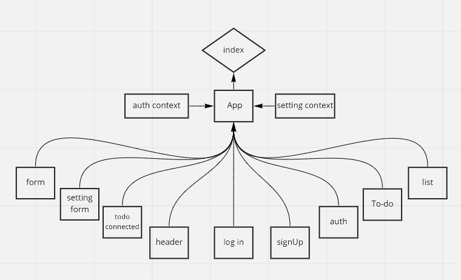

## LAB 31 - Context API
#### To Do List Manager Phase 1: Incorporate configuration settings to the application

In this phase, we’ll be adding some top-level settings for the application, so that the user can make some display choices that the app will use by default.

### Phase 1 Requirements
In Phase 1, we’re going to perform some refactoring of the To Do application as built by another team. This application mixes application state and user settings at the top level and passes things around. It was a good proof of concept, but we need to make this production ready.

- Style the application using the Blueprint Component API{target:_blank}

- Properly modularize the application into separate components

- Implement the Context API to make some basic application settings available to components

1- How many To Do Items to show at once
2- Whether or not to show completed items

#### Based on global configuration

- Show a maximum of a certain number of items per screen in the <List /> component
- Provide “next” and “previous” links to let the users navigate a long list of items
- Hide or show completed items in the list

#### Implement this using context

- Create a context for managing application display settings and provide this at the application level
- Display or Hide completed items (boolean)
- Number of items to display per screen (number)
- Default sort field (string)
- Manually set (hard code) those state settings in the context provider’s state, they should not be changeable

## Links:

codesandbox: https://codesandbox.io/s/hungry-oskar-yk1i9

PR: https://github.com/Batoolayyad/todo-app/pull/5

## UML:

## LAB 32: Context API - Behaviors
#### To Do List Manager Phase 2: Incorporate configuration settings to the application

In this phase, we’ll be adding an editor so that users can save their preferences for the application, allowing them to change some of the default behaviors

### Phase 2 Requirements
In Phase 2, we’re going to extend the functionality of our application by allowing the user to make some decisions on how they would like the application to function. Specifically, we’ll let them make changes to 2 settings.

#### Implement the Context API to make some basic application settings available to components
- How many To Do Items to show at once
- Whether or not to show completed items
#### Provide the users with a form where they can change the values for those settings
- This should be given in the form of a new component, perhaps linked to from the main navigation
- Hint: Use Browser Router to create the page/route/component for this
##### Save the users choices in Local Storage
##### Retrieve their preferences from Local Storage and apply them to the application on startup

### Technical requirements for the core application are unchanged from the prior phases, with the following additions and notes:

#### Based on global configuration

- Show a maximum of a certain number of items per screen in the <List /> component
- Provide “next” and “previous” links to let the users navigate a long list of items
- Hide or show completed items in the list
- Optional: Sort the items based on any of the keys (i.e. difficulty)

#### Implement this using context

- Create a context for managing application settings and provide this at the application level
- Display or Hide completed items (boolean)
- Number of items to display per screen (number)
- Default sort field (string)
- Create a function in your context that saves user preferences (for the above) to local storage
- Implement a useEffect() (or componentDidMount()) in your context to read from local storage and set the values for those 2 state properties on application load

### Links:

codesandbox:
https://codesandbox.io/s/silly-rhodes-08qo5

PR: 
https://github.com/Batoolayyad/todo-app/pull/4

### UML

## LAB 33: Login and Auth 

### Phase 3 
add the requiring for users be logged in to view items and also restrict access based on user type. 

- allow users to create new accounts and login to their accounts

- only fellow users that are allowed to “create”, based on their user type, can add new To Do Items
- ensure that only fellow users that are allowed to “update”, based on their user type, can mark To Do Items complete
- ensure that only fellow users that are allowed to “delete”, based on their user type, can delete new To Do Items

### Technical Requirements 

#### Implement a Login/Auth React Context, “protect” the To Do application by restricting access to the various application features based on the users’ login status and capabilities.
##### Define a function that can simulate a login event.
- Parameters: username and password as strings.
- Sets a User on the auth context, and changes login status to true.
##### Define a function that can simulate a logout event.
- Resets the User object and changes login status to `false.
##### Define a function that can authorize a User based on a capabilty.
- Parameters: a capability as a string.
- Returns a boolean whether the user has the capabililty parameter.

#### Create an <Auth /> component with the following features:
#### Given a capability prop of type string, conditionally render components based on the user stored in context.
- Hide the entire interface until the user has logged in.
- Implements RBAC rules:

- Implement a <Login /> Component that has the following features:
- Provide an account login screen with a form.
- Accepts Username and Password
- On successful login, store the token as a cookie
- If a user returns and has a valid login cookie, hide the login form and consider them “Logged In”
- Display a logout button instead of a form if they are “Logged In”.

### Links:

PR: https://github.com/Batoolayyad/todo-app/pull/7

codesandbox: 
- https://codesandbox.io/s/3ve07
- https://3ve07.csb.app/

### UML

## LAB 34 - API Integration
#### To Do List Manager Phase 4: Integrating with a live API

In this final phase, requiring that users be logged in through a live authentication server, in order to see the to do items. Additionally, based on their user type, they will be allowed (or denied) to perform actions such as editing or deleting them. All To Do items will be stored in a database, accessed through a deployed API

#### Phase 4 Requirements

##### Alter the Add, Toggle Complete, and Delete functions within your to do application to use your API instead of in memory state.
##### Fetch the current list of items from the database on application start
##### Whenever you add/update/delete an item, refresh the state so the user can instantly see the change

### API Server

#### GET /todo: Gets a list of all items
- ‘POST /todo’: Adds an item
- ‘PUT /todo’: Updates an item (you’ll use this to mark them as complete)
- ‘DELETE /todo/:id’ : Deletes an item
#### Authentication Server
##### You will need a deployed Authenticated API Server, which supports:
- Registration (/signup)
- Login (/signin)
- Authorization (via Bearer Token)
- ACL (using user roles)
- Make sure you have created the user roles and permissions lists that your front-end is expecting to tap into
- To Do data model for storing the actual to do items

### links:

- https://github.com/Batoolayyad/todo-app/pull/12

- https://jo9jl.csb.app/
- https://codesandbox.io/s/black-dawn-jo9jl

### UML

